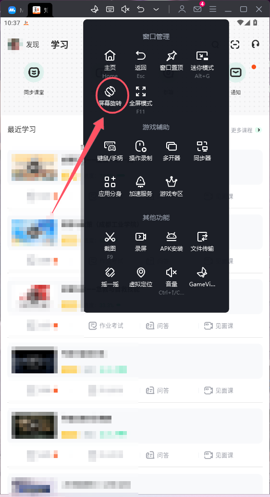
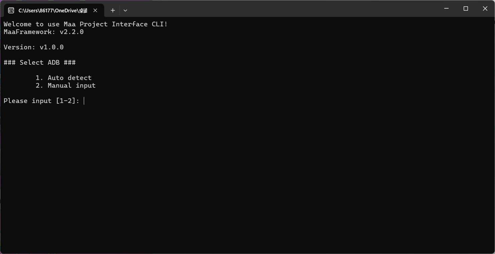
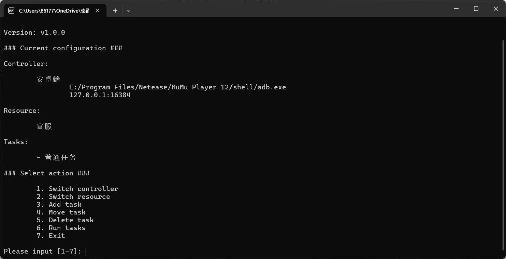

# 说明

本脚本基于**[MaaFramework](https://github.com/MaaXYZ/MaaFramework)**开发，主要用于挂学校的水课🤗，可以高速关闭弹题，以达到挂网课的目的，但目前海没解决人机验证的问题，只能手动解决

# 使用教程

## 配置环境

1. 下载任意模拟器（这里使用的是[mumu12](https://mumu.163.com/)）
2. 在模拟器中安装知到
3. 下载本库[MZHSGWK](https://github.com/qiushaonan/MZHSGWK/releases/tag/v1.0.0)，并解压

## 模拟器的相关准备工作

1. 点击进入知到APP

2. 点击进入想刷的课程，关闭无关弹窗，让界面上显示**上次学到XXXX继续学习**的字样

3. 点击屏幕旋转，如下图

   

## 配置脚本

1. 启动`MaaPiCli.exe`，会显示以下界面

   

   

2. 我们选择选择1，并稍等片刻，然后会跳出含有MuMuPlayer12的选项，我们选择它

3. 然后会有`普通任务`的选项，选择之后会出现以下画面

   

4. 我们选择6，就开始运行脚本了

